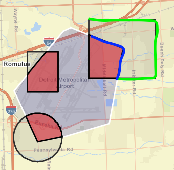
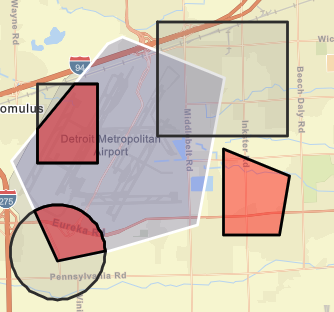
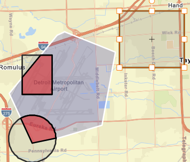

## Approach Working On this Challenge

One of the first things I did working on this challenge is scan the project to understand its structure and code base. Run the app and understand its features what could be added based on requirements and hints provided. After understanding the requirements, I proceeded to how to design the solution and I did as follow: 
### Create classes with single responsibilities

- Area calculations 
- Geometry Intersection 
- Sketching On Map 
- Sketch events handler 

### Display Flight Status Message 

I had to create an observable (Can Fly Status?) with an action that will have the value whether flight area is approved or denied. Furthermore, to show flight status in the UI I had to bind the observable to the Info component. 

 

### Calculate Geometry Area 

I wrote Area class that calculates both the geodesic and planar areas. The calculated areas will return a string number that is fixed to two decimal places and display it on the Info component if an intersection between user flight area and no-fly zones exist. 

### Determine Geometry Shape Intersection with No-Fly Zone 

Created a GeometryOnMap class to determine if an intersection exist between flight area and no-fly zone. The geometryEngine in ArcGIS JavaScript API has an intersects method that returns a Boolean of whether two geometries intersect. In addition, it provides an intersect method that returns the geometry shape of where two geometries intersect and I used this method to determine both the intersection and the flight status message.  

### Deployed the Project to GitHub Pages 

I have never deployed an app to GitHub Pages before and was excited I will be learning how to do that as part of this challenge. I am amazed how fast I had a deployed working react app using GitHub Pages which took me ten minutes deploying for the first time ever. I will without a doubt use it in the future for personal projects and at work.  

 

### Update Intersection Graphic When Sketch is Moved 

My approach when intersection exist, I created a Graphic in the sketch layer of the intersection to highlight it and calculate its areas. I wrote this feature to update the intersection shape and areas when the flight area sketch is selected not the intersection shape. I am not sure if this is what was intended from above requirement; However, the reason being is because that intersection shape was created due to the flight area shape intersection with no-fly zone and if it were not for the flight area shape being created the intersection shape would not exist.  

For this requirement, I wrote a sketch update event that would update the flight area intersection shape, area, and flight status. When the user moves or drags the flight area shape its intersection, area, and flight status will update if it intersects with the no-fly zone. You can create as many flight area sketches that have intersection with no-fly zone and each will update its corresponding intersection as the user moves or drags. Since each flight area is guaranteed to have either zero or one intersection, I used a hash map data structure that will store the flight area Graphic object as a key and its corresponding intersection shape as its value. This allowed me to update the proper intersection in the UI. If no intersection exist nothing will be stored in the hash map and if a shape had an intersection and was updated to not intersect with no-fly zone the hash map will be updated to delete the key and value pairs for that shape.  

## Ideas to Tackle 

Due to limited time and travels from my side, below are some items/ideas I would love to tackle 

### Fix Moving Intersection Shape Defect 

Currently, when a user selects the intersection shape that is highlighted in blue lines as shown below instead of the shape highlighted in green, the intersection shape can be moved out of the no-fly zone and will remain highlighted in red.  

Selecting Shape highlighted in blue lines above will result in below image

If you select shape highlighted in green lines it will result in below image

### If Intersection Occurs Determine Safe Zone 

If an intersection occurs with no-fly zone for a specific flight area, determine the furthest two coordinates from intersection and label as safe zone. This can be solved by calculating the distance between flight area coordinates and all the coordinates from intersection shape. Store the distance in a max-heap, retrieve the max two coordinates and label as safe zone.  

### Support Multiple No-Fly Zones and Multiple Shape Update 

I think it will be interesting to support multiple No-Fly zones and multi-select flight area shape updates. I am very curious how the performance will be and how challenging it would be to improve performance if its slow or lagging.  

### Flight Area Toggle Visibility 

This was one of the extra credit ideas that would be nice to figure out if I had more time. I briefly looked into it and I think FeatureLayer is the correct candidate for this feature.  

 
### Unit Testing 

Also, this was one of the extra credit ideas that I tried to complete but had some troubles. My tests were failing due to Jest complaining about ArcGIS imports in my code. I was able to mock ArcGIS classes but then Jest complained about functions being imported. I found multiple posts online suggesting to fix this since many people have the same issue but none worked. This will need more time to get it to work so I decided to bypass though I broke my code down to smaller classes so I could easily test them but it is unfortunate.  
 
